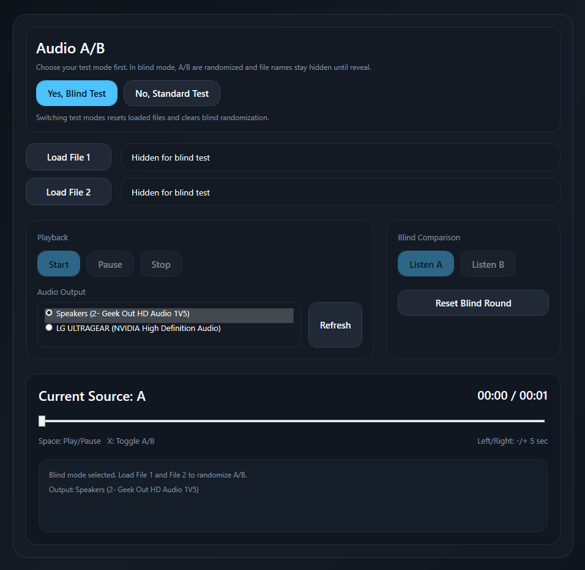

# AudioABTester

AudioABTester is a Windows 11 desktop app for critical A/B listening. It loads two audio files, decodes both into a shared PCM format, starts them on the same timeline, and switches between A and B by changing gain only. Playback does not restart during comparison.

## Screenshot



## Quick Start

1. Launch the app and pick a mode in the header:
	- `No, Standard Test` for direct A/B
	- `Yes, Blind Test` for randomized hidden mapping
2. Pick your output device in the Playback panel.
3. Load two files:
	- Standard: `Load A` and `Load B`
	- Blind: `Load File 1` and `Load File 2`
4. Press `Start`, then compare using `Listen A`, `Listen B`, or keyboard `X`.
5. In Blind mode, click `Reveal A/B Mapping` when done.
6. Use `Reset Blind Round` to run another blind round without restarting.

## Stack

- C#
- .NET 8
- WPF
- MVVM
- NAudio
- WASAPI shared output

## Architecture

- `AudioEngine` owns a single `WasapiOut` instance and a single composite `ISampleProvider`.
- `AudioTrack` caches decoded PCM samples in the output device's mix format so both tracks share the same sample rate and channel layout.
- A single frame cursor is advanced by the output callback, which keeps both tracks sample-aligned over time.
- A/B switching changes gain only; it never stops, seeks, or recreates playback.
- `VolumeMatchService` is a placeholder for future RMS/LUFS loudness matching.

## Supported Formats

- `.wav`
- `.mp3`
- `.flac`
- `.aiff`

`AudioFileReader` relies on Windows decoding support for formats such as FLAC.

## Controls

- Mode selector in header:
	- `Yes, Blind Test`
	- `No, Standard Test`
- Standard mode:
	- `Load A`, `Load B`
- Blind mode:
	- `Load File 1`, `Load File 2`
	- `Reveal A/B Mapping`
	- `Reset Blind Round`
- `Start`, `Pause`, `Stop`
- `Listen A`, `Listen B`
- Slider scrubber
- Output device selector (radio list) + `Refresh`

Keyboard shortcuts:

- `Space`: Play/Pause
- `X`: Toggle A/B
- `Left Arrow`: Rewind 5 seconds
- `Right Arrow`: Forward 5 seconds

## Standard vs Blind Workflow

### Standard Mode

1. Select `No, Standard Test`.
2. Load A and B directly.
3. Start playback and compare with `Listen A`, `Listen B`, or `X` toggle.

### Blind Mode

1. Select `Yes, Blind Test`.
2. Load `File 1` and `File 2`.
3. The app randomizes assignment into internal A/B, hides file names, and prompts to start listening.
4. Compare with normal A/B listening controls (identity hidden).
5. Click `Reveal A/B Mapping` to display which file became A and B.
6. Click `Reset Blind Round` to clear the round and load again without restarting the app.

### Mode Switching Safety

Switching between Standard and Blind modes performs a full reset:

- Loaded tracks are cleared from the audio engine.
- Blind randomization state is cleared.
- File labels reset to `No file selected`.
- Users must reload files in the newly selected mode.

## Build

Install the .NET 8 SDK, then run:

```bash
dotnet restore
dotnet build
```

## Publish

Release publishes are configured for self-contained, single-file `win-x64` output.

```bash
dotnet publish -c Release
```

The executable will be produced under `AudioABTester/bin/Release/net8.0-windows/win-x64/publish/`.

## Windows Installer (EXE)

Use Inno Setup to create a traditional Windows installer that your friend can run.

1. Install Inno Setup (6.x):
	- https://jrsoftware.org/isinfo.php
2. Publish the app to a stable folder:

```bash
dotnet publish AudioABTester/AudioABTester.csproj -c Release -r win-x64 --self-contained true -p:PublishSingleFile=true -o installer/publish
```

3. Open `installer/AudioABTester.iss` in Inno Setup Compiler.
4. Build the installer from the Inno Setup UI (Build -> Compile).
5. The output installer will be created in `installer/output/`.

What the installer does:

- Installs to Program Files
- Adds Start Menu and optional Desktop shortcuts
- Supports uninstall from Apps & Features
- Includes all published files required to run

Tip: Keep version numbers in `installer/AudioABTester.iss` updated for each release.

## GitHub Cloud Build (Actions)

Yes. This repository now includes a GitHub Actions workflow that builds in the cloud on Windows, publishes the app, compiles the Inno Setup installer, and uploads both as artifacts.

Workflow file:

- `.github/workflows/build-installer.yml`

How to run it:

1. Push your changes to GitHub.
2. In GitHub, open Actions -> Build Windows Installer.
3. Click Run workflow (manual trigger), or push a tag like `v1.0.0`.
4. After it finishes, download artifacts:
	- `AudioABTester-installer` (setup EXE)
	- `AudioABTester-publish` (published app files)

The workflow uses `windows-latest`, installs .NET 8 SDK, installs Inno Setup via Chocolatey, and compiles `installer/AudioABTester.iss`.

## Notes

- Blind and Standard workflows now share one transport while keeping mode-specific loading/reveal behavior in the ViewModel.
- Output device routing is user-selectable from the Playback panel and can be refreshed at runtime.
- Waveform rendering, loudness matching, markers, and playlist support can be layered on top of the existing engine and view-model boundaries.

## Open Source

- License: MIT (see `LICENSE`)
- Contributions: see `CONTRIBUTING.md`
- Community expectations: see `CODE_OF_CONDUCT.md`